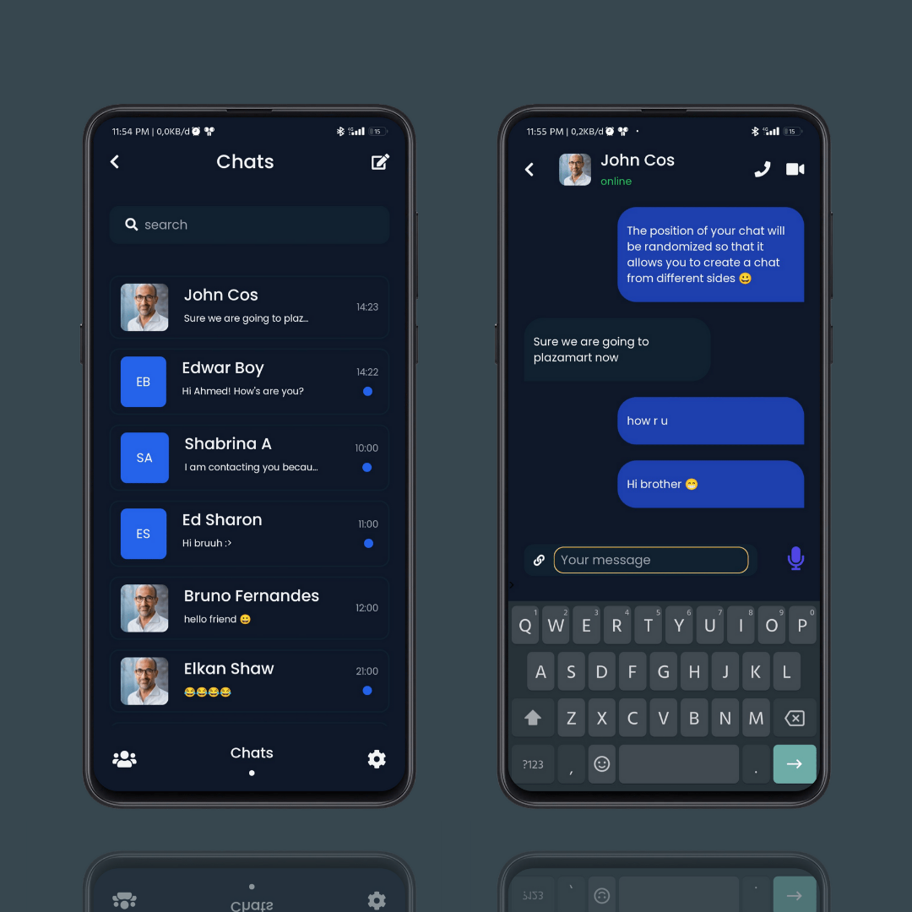
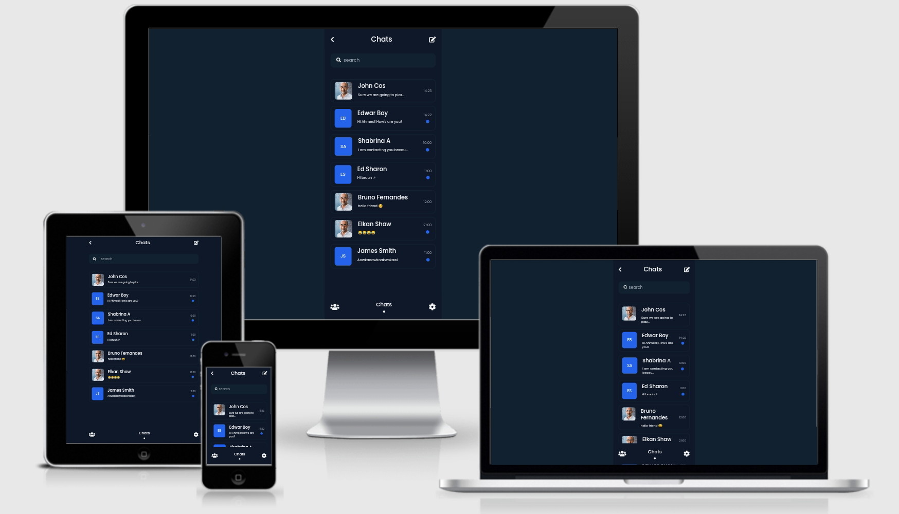

<h3 align="center">Chat App</h3>

Slicing project #08

### About
This is my projects to make UI using front end tech 

Where the ideas and the concept i use from any other designer UI/UX from Instagram or Dribbble

### Original design
by [Imelda](https://dribbble.com/shots/17486130-Chat-App)

## Responsive Test

## Languages and Tools
- Vue JS 3
- Tailwindcss
- Pinia state management
- Vue router
- Font Awesome 5
- Google Fonts Poppins
- Vite JS
- Git 
- Github
- Vercell
- Termux
- Micro Text Editor

### How to install
- <code>git clone https://github.com/or-abdillh/chat-app.git </code>
- <code>cd chat-app</code>
- <code>npm install</code>
- <code>npm run dev</code>

### Demo 
- [Chat App](https://chat-app-1-one.vercel.app/)

### Thanks 
- Support me with a cup of coffee and other snacks [here ..](https://saweria.co/orabdillh)
- Don't forget to give me star in this repository 🙏🏻🙏🏻
- See my other projects on instagram [@or.abdillh](http://www.instagram.com/or.abdillh)

[Oka R Abdillah ](http://github.com/or-abdillh)
 
Last edited on : 14/02/2022